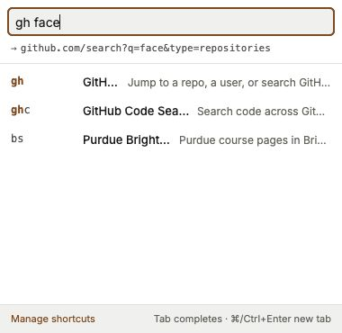

# BunnyLol

[](https://github.com/ion05/bunnylol/actions/workflows/ci.yml)
[](LICENSE)

BunnyLol turns the Chrome address bar into a command line. Type a keyword and its arguments and you
land on the page itself, not on a results page:

```
gh facebook/react   →   github.com/facebook/react
npm zod             →   npmjs.com/package/zod
c explain monads    →   Claude, with the prompt already in the box
```

It is an independent, unofficial project, inspired by the bunnylol-style command bar used inside
Meta. **Not affiliated with, endorsed by, or sponsored by Meta Platforms, Inc.**

Manifest V3. 93 shortcuts ship across 180 keywords, and every one of them can be renamed, re-keyed,
moved, switched off or deleted. No runtime dependencies, no network requests of its own, and nothing
leaves your machine. See [PRIVACY.md](PRIVACY.md).

<!--
SCREENSHOTS: not captured yet. This is the right place for them.

Capture three PNGs at 1280x800 (the Chrome Web Store's required screenshot size, so the same
files serve the listing), light theme, on a clean profile, then commit them to `docs/images/`
and uncomment the block below.

  docs/images/address-bar.png   The address bar mid-type, showing `gh facebook/react` typed into
                                a real Chrome window, with the omnibox dropdown visible.
  docs/images/options.png       The options page on the Shortcuts tab (`options.html#help`), with
                                two or three groups expanded and the "Hidden shortcuts" group
                                visible at the foot.
  docs/images/popup.png         The toolbar popup open over any page, with a partial query typed
                                and the autocomplete list showing.

A 440x280 small promo tile is a separate asset; see docs/chrome-web-store.md.



-->

## Install

### From the Chrome Web Store

Not listed yet. [docs/chrome-web-store.md](docs/chrome-web-store.md) holds the submission material.
The link goes here once the listing is live.

### From source

Node 22.13 (pinned in `.nvmrc`, so `nvm use` picks it up, and in `engines.node`) and pnpm, which is
pinned by `packageManager` in package.json. Do not run `npm install`: it creates a second lockfile.

```bash
pnpm install
pnpm build
```

1. Open `chrome://extensions`.
2. Turn on **Developer mode** (top right).
3. Click **Load unpacked** and select this repo's `dist/` folder.

After you pull, run `pnpm build` again, then press the reload arrow on the extension card. Editing
source does not update a loaded extension.

**Chrome 123 or newer.** The UI declares its colours with CSS `light-dark()`, which Chrome added in
123. On anything older, every themed colour falls back to `unset` and the pages are unreadable.
`minimum_chrome_version` in the manifest records the same floor. Other Chromium browsers work the
same way: the MV3 manifest, the service worker and the redirect rules all behave identically. But a
fork that routes the omnibox itself may not hand over address-bar navigations. There the toolbar
popup and `bl` + Tab still work.

## The one rule

**The first word wins.** If the first word you type in the address bar is a keyword you have, it is
a command. Always, with no heuristics. `c programming tutorial` opens Claude with that prompt. `pr
firms in new york` opens your GitHub pull requests. `map of france` opens Google Maps. That is the
contract, and it is what makes the address bar predictable. You never wonder whether a keyword will
fire this time.

The other half is how to say *no, actually search for that*. It takes one keystroke:

| Type this | You get |
|---|---|
| `\gh foo` | A plain search for **gh foo**. A leading backslash escapes the whole query. |
| `=gh foo` | Identical. `=` is the same escape, one unshifted key on every layout. |
| `g wagon price` | A Google search for **wagon price**. `g` is the "search Google" command, and its argument is what gets searched. |
| `ddg …` | The same, on DuckDuckGo. |

Note the difference between the first two rows and the third. To search for the literal phrase **g
wagon price**, escape it: `\g wagon price`. Do the same for `pr` (`\pr firms in new york`) and
anything else. The escape character is stripped before the search, so it never reaches the engine as
a search term. It works on every surface, because they all run the same resolver.

Curating a list of "safe" words on your behalf was tried and dropped. It is an endless tail: a large
fraction of the keywords that would have stayed eligible could still hijack some plausible English
query, and blocking those only surfaced the next tier (`td`, `iss`, `bs`, `gs`). Worse, it made
behaviour unpredictable in the one place where predictability matters. So the trade is explicit.
Every keyword fires, every time, and the escape hatch has to be flawless. If one keyword still
annoys you in practice, exempt exactly that one (below). Nothing ships exempted.

Under the hood, BunnyLol tags its own searches with a `blpass=1` parameter and registers a
top-priority `allow` rule for anything carrying that tag. Without it, an escaped search would land
on `google.com/search?q=gh+foo`, which is the very URL the redirect rule was built to catch, and you
would bounce back into the shortcut you were escaping. If you see that parameter in an address bar,
it is BunnyLol's, and it does nothing.

## First run

The first install opens a **welcome screen**. It asks one question: which packs of shipped shortcuts
do you want? Only **Search**, **Developer** and **AI** are ticked. Every other pack is offered
unticked, and its shortcuts start switched off: **Google**, **Microsoft**, **Social**,
**Productivity**, and, under *Optional packs*, **Purdue**. Purdue is one university's tooling, dead
weight for everyone else. **Skip**, or closing the tab, keeps that starter set. The pick is written
before the screen opens, so it is already live.

Nothing there is final. You can rename, move, switch off or delete every shortcut afterwards. To
change the pick later, go to **Settings → Sections → Shortcut packs → Choose shortcut packs…**. That
opens a **Shortcut packs** screen of its own: the same cards, with Save and Cancel in place of the
first-run text. To see the welcome screen itself again, on an empty profile, use **Settings → Data →
Start over**.

Note what saving a pick means, on either screen. It turns *on* every shipped shortcut in the packs
you tick, including ones you had switched off by hand. It turns off the ones in the packs you leave
unticked. It never touches shortcuts you made yourself.

## The three ways in

Google stays your real default search engine. Nothing about your browser settings changes.

- **Address bar (primary).** A `declarativeNetRequest` rule matches search URLs whose query starts
  with a keyword you have. It redirects them to the extension's local dispatch page before any
  request leaves your machine. That page resolves the keyword and replaces itself with the
  destination:

  ```
  google.com/search?q=gh+facebook/react   →   go.html?q=gh facebook/react   →   github.com/facebook/react
  ```

  A separate rule with higher priority matches a query that *starts* with an escape character. It
  covers both the raw and the percent-encoded form, because Chrome sends `\` to the engine as `%5C`.
  So `\gh foo` is intercepted too, and turned into a clean search for "gh foo". The rules are
  rebuilt from your live keyword list whenever you change a shortcut. An ordinary search like `how
  tall is the eiffel tower` never matches and is not slowed down. Bing and DuckDuckGo are
  intercepted the same way, and you can switch off each engine in Settings.

- **Omnibox keyword (fallback).** Type `bl`, press **Tab**, then your command. This path does not
  use the redirect rules at all. So it is the safety net if interception behaves differently in your
  browser, and it is where an exempted keyword still works.

- **Toolbar popup.** Click the BunnyLol icon for a command bar with autocomplete over the same
  registry. Handy when you are already on a page.

All of them run the same resolver, so a shortcut behaves the same no matter how you invoke it.

### Exempting a keyword you keep tripping over

Settings has an **Exempt keywords** card. Type the keyword, press Add, and the address bar skips it
from then on. Remove the chip to get interception back.

An exemption costs the keyword nothing but address-bar interception. It still resolves through `bl`
+ Tab and the toolbar popup, where you have already said you mean a command.

### Seeing which command fired

**Confirm before opening a shortcut** sits at the foot of the **Search interception** card, and is
off by default. With it on, the dispatch page stops instead of redirecting. It names the keyword
that fired and the shortcut it matched, prints the whole URL it is about to open, and waits.
**Open github.com** goes there, and it holds the focus, so Enter is enough. **Search for what you
typed instead** runs the escaped search. There is no timer: nothing moves until you answer, and
closing the tab is a third answer. Turn it on while you are learning the keywords, then turn it off.

## What ships

A bare keyword goes to the site's home page. Adding arguments does the smart thing.

| Type this | You get |
|---|---|
| `gh facebook/react` | `github.com/facebook/react`, the repo itself, not a search |
| `gh` | GitHub home |
| `c explain monads` | Claude with the prompt already filled in (`gpt` for ChatGPT, `gem` for Gemini) |
| `npm zod` | The `zod` package page, skipping npm's search results |
| `gr project hail mary` | The book on Goodreads |
| `def ineffable` | The dictionary entry |
| `rd rust` | `reddit.com/r/rust` |
| `td groceries` | Searches your Todoist tasks; `tda groceries` is the one that creates one |
| `zoom 1234567890` | Joins that meeting; `zoom h6 recorder review` searches instead of building a dead join link |
| `track 9400…` | Reads the carrier off the number (UPS, USPS, FedEx or DHL) and opens its tracking page |
| `set` | The options page. `bl` opens the shortcut list, `add` opens the new-shortcut form |
| `\gh` *anything* | Escape hatch: a leading `\` (or `=`) forces a plain search instead of a shortcut |

Some of those rows are not in the starter set. `rd` is in the **Social** pack, and `td`, `tda`,
`zoom` and `track` are in **Productivity**. Both packs start switched off, which means their rows
are under **Hidden shortcuts** rather than missing. Tick the packs on the welcome screen, or later
from **Settings → Sections → Shortcut packs**. Everything else in the table ships on.

That is a sample. The full registry is [`src/lib/commands.ts`](src/lib/commands.ts), which is plain
data: 93 shortcuts, 180 keywords, one row each with its destination and a worked example. The
options page renders the same list with a filter box, which is the better way to browse it.

## Managing shortcuts

Open the options page from the popup, from `set` in the address bar, or by right-clicking the
toolbar icon → **Options**. It has three tabs: **Shortcuts**, **New shortcut** and **Settings**.

- **Shortcuts** lists everything, grouped, with a live filter (press `/`). Groups collapse, and each
  browser profile remembers its own state. Typing in the filter expands them until you clear it.
  **Collapse all** and **Expand all** are in the panel head.
- **A switched-off shortcut is not in its section.** Every one of them is in a single **Hidden
  shortcuts** group at the foot of the page, which is where the packs you did not tick are too. It
  is the one group that starts folded. Switching a row back on there moves it to its own section
  immediately, and switching one off sends it down here.
- **You can take a whole section back at once.** Inside **Hidden shortcuts** the rows are grouped by
  the section they go back to, and each of those runs has one button. It says **Turn on all of
  Developer** when nothing in that section is on, and **Turn on the rest of Developer** when some of
  it already is, because a section is often only partly switched off. When more than one section has
  rows down here, **Turn them all on** empties the whole group. Nothing asks you to confirm: the
  switches it puts back are the way to undo it.
- **Every shortcut is editable, whether it ships with BunnyLol or you made it.** A row's actions are
  Edit and Delete, as icons labelled on hover, followed by the on/off switch. They mean the same
  thing on both kinds. The form takes keys, name, description, URL, an optional search URL
  containing `{q}`, a section and an example. A live preview shows where a sample query would
  actually land as you type. Duplicate keys, malformed URLs and a missing `{q}` are flagged before
  you can save.
- **Reset**, in the form, refills the inputs. For a shipped shortcut it uses the shipped definition.
  For one of your own it uses the values you last saved. It does not touch the on/off switch, and it
  saves nothing by itself. Save does that.
- **Shipped shortcuts are never mutated.** An edit is stored as a diff against the shipped
  definition. So if all you did was rename the command, a corrected URL in a later build still
  reaches you. Edited rows carry a *modified* badge.
- **Deleting a shipped shortcut is not reversible one shortcut at a time.** There is no per-shortcut
  restore. What brings one back is **Settings → Data → Reset to defaults** or **Start over**, both
  of which restore every shipped shortcut and discard everything else, or importing a file that
  predates the delete with **Replace everything**. **Merge** will not do it: the two sides'
  deletions are unioned, so merging an older export leaves the shortcut deleted. Switching a
  shortcut off is the reversible one. It goes to **Hidden shortcuts** and comes back with a click.

### Sections

Sections are the groups in the list. Any shortcut can go in any section, including the ones that
ship. Renaming *Developer* renames the heading everywhere.

Create a section from **Settings → Sections**, or from the **New section…** row in the form's
section menu. That row files the shortcut you are editing straight into it. Deleting a section does
not delete its shortcuts. They move to **My shortcuts**, which is where new ones start.

### Import, export and packs

**Settings → Data** exports your whole customisation layer plus your settings to one JSON file, and
reads it back. That is how you move shortcuts between browsers and profiles. Each one has its own
extension storage, and nothing is synced through an account.

Importing asks first. The dialog spells out what each choice does before anything is written:

- **Merge** adds the file's shortcuts to the ones you have. Yours win every collision. An incoming
  alias that is already taken is renamed (`gh` → `gh2`) rather than overwriting yours, and shortcuts
  identical to ones you have are skipped. Your settings are left alone.
- **Replace everything** deletes your shortcuts and installs only what is in the file. If the file
  carries settings, yours are replaced too. If it does not, yours stay.

The dialog itemises what will happen before you commit: what comes in, which keywords get renamed,
and which shipped shortcuts the file turns off or edits. **Cancel** writes nothing. Either way, a
timestamped backup of your current state is downloaded first, so "undo" is a file in your Downloads
folder. Files written by older versions still import.

A **pack** is just an import file someone else prepared. [`extras/packs/`](extras/packs/) holds the
ones this repo ships, including `removed-commands.json`, the shortcuts that used to ship. [Its
README](extras/packs/README.md) documents the format if you want to write one.

**Reset to defaults**, in the same card, deletes every shortcut you made. It restores every shipped
one you turned off or deleted, forgets your sections, and puts settings back.

**Start over**, below it, goes further. It erases every shortcut, edit, section and setting, then
runs the first-install setup again and opens the welcome screen. The profile ends up exactly as it
is after a fresh install, so this is also how you see the welcome screen a second time. Export
first if you want your shortcuts back.

### Settings

| Card | What is in it |
|---|---|
| **Default Usernames** | Your GitHub username, which `gh me` resolves to; the fallback search engine, where an unmatched query goes (Google, Bing, DuckDuckGo, Kagi and Brave Search are one click away, or paste any template containing `{q}`); and your Google account index for `/u/N/` URLs |
| **Sections** | Create, rename and delete sections, one row each; and **Choose shortcut packs…**, which opens the packs screen |
| **Search interception** | Which engines are intercepted (untick them all to leave every search alone), the dispatch-page URL to paste in as a custom search engine, and **Confirm before opening a shortcut** |
| **Exempt keywords** | The keywords the address bar leaves alone |
| **Data** | Export, import, **Reset to defaults**, and **Start over**, which erases everything and reruns the first install |

### Rule status

A pill in the options page header reports what the redirect rules are *actually* doing. It reads
that back from Chrome, not from what BunnyLol asked for. It appears only when there is something to
say: a healthy profile shows no pill at all, and neither does one whose only shortfall is a keyword
you exempted yourself.

| Pill | Colour | Meaning |
|---|---|---|
| nothing | | Every eligible alias is intercepted on every engine you selected, with nothing dropped. |
| *Some keywords not intercepted* + a detail line | amber | Partial coverage. The rules are live, but some aliases ended up without one, because Chrome refused to compile their pattern or the rule budget filled up. The detail says which. In the address bar they fall through to a normal search. |
| *Interception off* | amber | No engines selected, so nothing is intercepted. That is by design. |
| *Rules not registered* | red | The sync itself failed and nothing is intercepted. The detail carries the error. Click **Re-sync**. |

Red and amber are two different fields. Red is a sync error. Amber is a warning from a sync that
worked.

## Troubleshooting

| Symptom | What is going on |
|---|---|
| **A keyword typed in the address bar just searches for it.** | The redirect rules are not registered. Check the rule-status pill and click **Re-sync**. The rules embed the extension's ID, so loading `dist/` from a new path changes the ID and needs a re-sync. Use `bl` + Tab meanwhile. |
| **Nothing happens, or the dispatch page shows an error.** | Open `chrome://extensions`, find BunnyLol and click **service worker** for its console. Rule-sync failures, storage errors and omnibox activity are logged there. The dispatch page prints the reason it could not resolve rather than hanging. |
| **An AI shortcut opens the site but does not carry the prompt.** | Those prefill parameters change without notice, and there is no settings card for them. Two ways round it without a rebuild. Make your own shortcut with the working URL as its **Search URL** and switch the shipped one off; a shortcut you create sends the prompt where you put `{q}`. Or export your JSON from **Settings → Data**, add the provider template to `settings.aiTemplates` (`{"claude": "https://claude.ai/new?q={q}"}`, keyed by `claude`, `chatgpt`, `gemini` or `claudecode`, and it must contain `{q}`), and import the file back with **Replace everything**, which is the choice that takes a file's settings. |
| **A shortcut collides with a phrase you actually search for.** | That is by design: the first word is always a command. Prefix it with `\` or `=`. If it happens constantly with one keyword, exempt it in **Settings → Exempt keywords**, or rename, switch off or delete the shortcut. |
| **`g wagon price` searched for "wagon price".** | Working as intended. `g` is the "search Google" command, and its argument is what gets searched. Use `\g wagon price` for the literal phrase. |
| **One shortcut works only from the popup or `bl` + Tab.** | Either it is exempted, or its alias cannot be embedded in a URL pattern, or the pill reports it as dropped because Chrome refused the pattern or the rule budget is full. Interception needs lowercase ASCII letters, digits, `_` and `-`, starting with a letter, digit or `_`, and at most 32 characters. All three cases leave the shortcut working everywhere else. |
| **A shipped shortcut points at the wrong place.** | Edit it. The Purdue shortcuts in particular read their host off the URL on the row, so rebinding one to another institution works. |

## Development

```bash
pnpm dev         # vite build --watch
pnpm typecheck   # tsc --noEmit
pnpm test        # vitest
pnpm build       # icons + typecheck + vite build -> dist/
pnpm package     # build, then release/bunnylol-<version>.zip for the Web Store
```

`pnpm typecheck && pnpm test && pnpm build` is the gate every commit has to pass, and it is what CI
runs. There is no linter and no framework: the UI is vanilla TypeScript and CSS, and the whole
project has four devDependencies.

The resolver (`src/lib/resolve.ts`) is pure and free of `chrome.*`, so the dispatch page, the
omnibox, the popup and the tests all share one code path.

The UI's colours, type scale and spacing come from one token set, [`design/`](design/). That folder
also holds the HTML previews the design was approved from. The pages ship the
[Inter](docs/fonts.md) variable font as a bundled file rather than a webfont request, so rendering
the extension's own pages needs no network.

## Contributing

[CONTRIBUTING.md](CONTRIBUTING.md) covers the setup, the checks a change has to pass, and how to add
a command. [AGENTS.md](AGENTS.md) is the architecture note. Read its invariants before you change
routing or validation: every one of them is a bug that already shipped once.
[CODE_OF_CONDUCT.md](CODE_OF_CONDUCT.md) applies. Released versions are listed in
[CHANGELOG.md](CHANGELOG.md).

## Privacy and security

No collection, no transmission, no analytics, no telemetry, no remote code, and no network requests
of its own. Everything is one JSON value in `chrome.storage.local` on your device. Full statement:
[PRIVACY.md](PRIVACY.md).

BunnyLol holds redirect rules on three search engines, so a routing bug here is a browsing-data bug.
Report a vulnerability privately through GitHub's Security tab rather than as an issue:
[SECURITY.md](SECURITY.md).

## License

[MIT](LICENSE). The bundled Inter font is licensed separately under the SIL Open Font License 1.1.
See [docs/fonts.md](docs/fonts.md).
