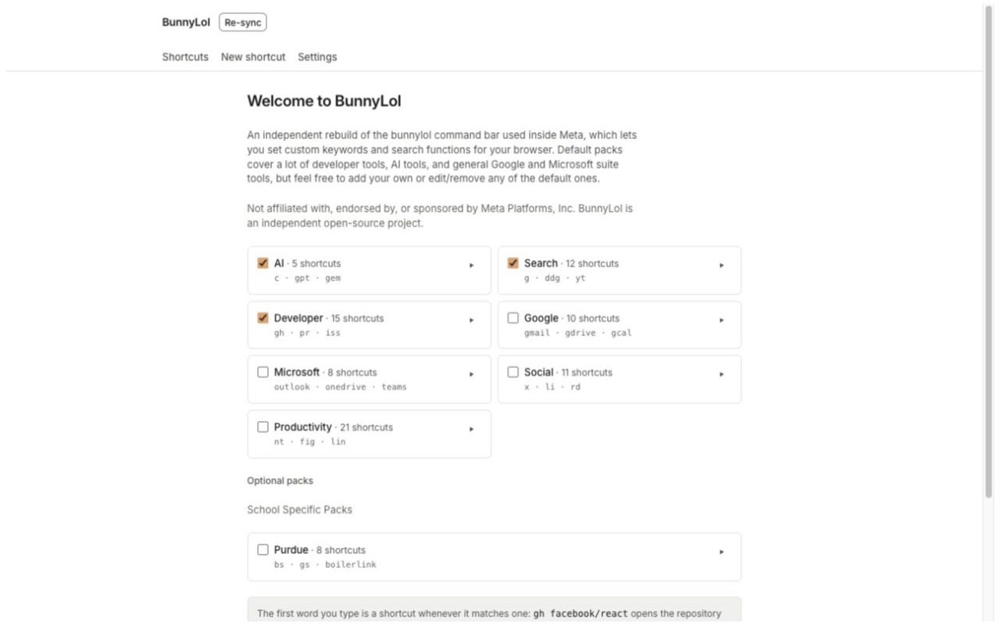
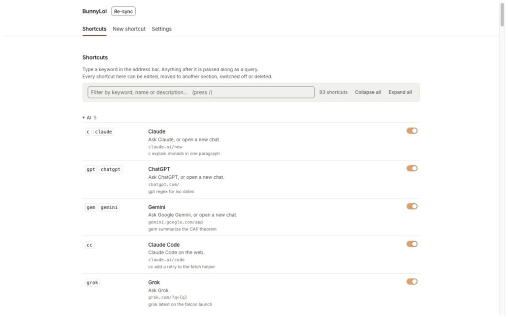
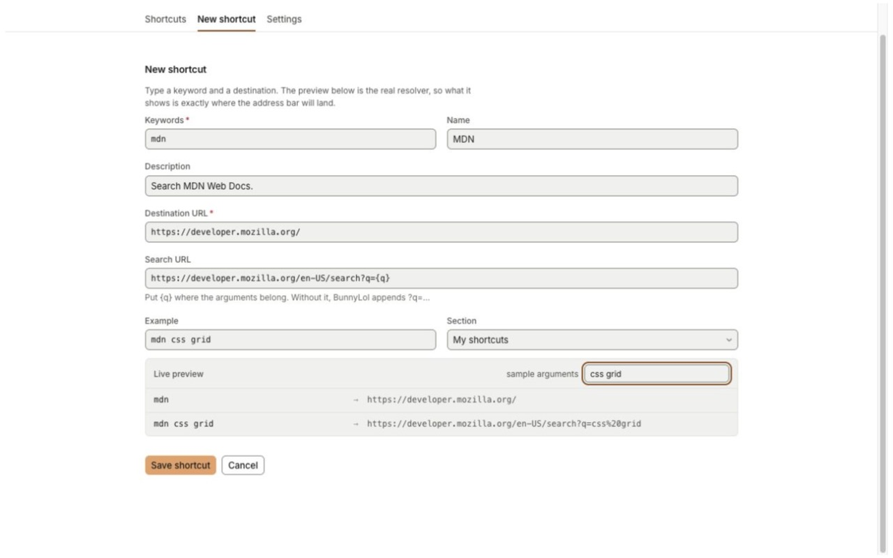

<p align="center">
  
</p>

# BunnyLol

[](https://github.com/ion05/bunnylol/actions/workflows/ci.yml)
[](LICENSE)

BunnyLol enables you to set custom shortcuts for websites in your browser, including faster
searches for supported websites.

```
gh facebook/react   →   github.com/facebook/react
npm zod             →   npmjs.com/package/zod
c explain monads    →   Claude, with the prompt already in the box
```

It is an independent, unofficial project, inspired by an internal tool at Meta called BunnyLol.
**Not affiliated with, endorsed by, or sponsored by Meta Platforms, Inc.**

Manifest V3. 93 shortcuts ship across 180 keywords, and every one of them can be renamed, re-keyed,
moved, switched off or deleted. No runtime dependencies, no network requests of its own, and nothing
leaves your machine. See [PRIVACY.md](PRIVACY.md).

## A look inside

Pick the built-in shortcut packs you actually want:



Browse, filter, edit and switch shortcuts on or off from one page:



New shortcuts use the same resolver as the address bar, so the form can show the real destination
before you save:



The toolbar popup gives you autocomplete when you do not want to leave the current page:

<p align="center">
  
</p>

## Install

### From source

Clone this repository and then run the following commands to build the extension

```bash
pnpm install
pnpm build
```
1. Open `chrome://extensions`.
2. Turn on **Developer mode**.
3. Click **Load unpacked** and select this repo's `dist/` folder.

**Chrome 123 or newer.** The UI declares its colours with CSS `light-dark()`, which Chrome added in
123. On anything older, every themed colour falls back to `unset` and the pages are unreadable.
`minimum_chrome_version` in the manifest records the same floor. Other Chromium browsers work the
same way: the MV3 manifest, the service worker and the redirect rules all behave identically. But a
fork that routes the omnibox itself may not hand over address-bar navigations. There the toolbar
popup and `bl` + Tab still work.


## Development

```bash
pnpm dev         # vite build --watch
pnpm lint        # eslint + prettier --check
pnpm typecheck   # tsc --noEmit
pnpm test        # vitest
pnpm build       # icons + typecheck + vite build -> dist/
pnpm package     # build, then release/bunnylol-<version>.zip for the Web Store
```


The resolver (`src/lib/resolve.ts`) is pure and free of `chrome.*`, so the dispatch page, the
omnibox, the popup and the tests all share one code path.

The UI's colours, type scale and spacing come from one token set, [`design/`](design/). That folder
also holds the HTML previews the design was approved from. The pages ship the
[Inter](docs/fonts.md) variable font as a bundled file rather than a webfont request, so rendering
the extension's own pages needs no network.

## Contributing

[CONTRIBUTING.md](CONTRIBUTING.md) covers the setup, the checks a change has to pass, and how to add
a command. [AGENTS.md](AGENTS.md) is the architecture note.
[CODE_OF_CONDUCT.md](CODE_OF_CONDUCT.md) applies. Released versions are listed in
[CHANGELOG.md](CHANGELOG.md).

## Privacy and security

No collection, no transmission, no analytics, no telemetry, no remote code, and no network requests
of its own. Your shortcuts and settings are one JSON value in `chrome.storage.local` on your
device, and the only other thing stored is which groups you have folded. Full statement:
[PRIVACY.md](PRIVACY.md).

BunnyLol holds redirect rules on three search engines, so a routing bug here is a browsing-data bug.
Report a vulnerability privately through GitHub's Security tab rather than as an issue:
[SECURITY.md](SECURITY.md).

## License

[MIT](LICENSE). The bundled Inter font is licensed separately under the SIL Open Font License 1.1.
See [docs/fonts.md](docs/fonts.md).
